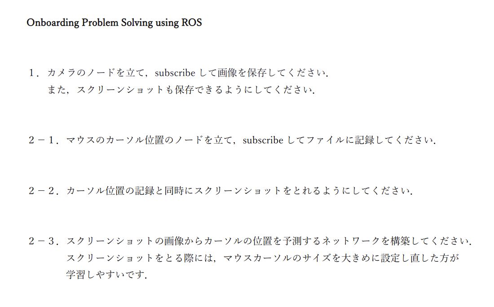

動かし方

- 課題1,課題2-1

  1. クローン ``` git clone https://github.com/shishamoid/b4onboarding_ros ```

  2. ```cd b4onboarding_ros```

  3. docker イメージをロード

     ```gzip ros_onboarding.tar.gz``` 

     ```docker load < ros_onboarding.tar ```

  4. docker run

     ```docker run --device=/dev/video0:/dev/video0 --network host -e DISPLAY=$DISPLAY -v /home/<username>/zemi/b4onboarding_ros:/root -v /tmp/X11-unix:/tmp/X11-unix:rw -it ros:melodic4```

  5. 各課題ごとディレクトリに移動,Pythonスクリプトを実行


- 課題2-2,課題2-3

  1. 環境作成

     ```pip install -r requirements.txt```

  2. 各課題ごとディレクトリに移動,Pythonスクリプトを実行


※ubuntu18.04のみ動作確認済

※課題1は```xhost local:```などでdisplayのアクセス許可をもらう必要あり

※課題2-2,2-3はコンテナの外で実行


